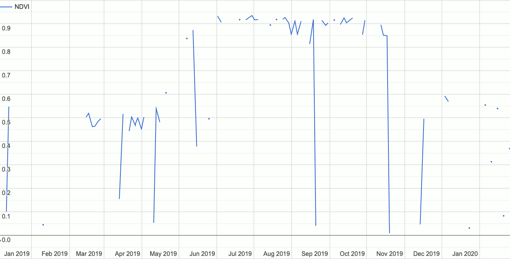

# GEEODE: A Google Earth Engine Implementation of Optimization by Differential Evolution



## 🌍🕰️ Summary 📈📉

Do you commonly use time series data in Google Earth Engine? Are you interested in modelling these time series using mathematical models of arbitrary forms (e.g., linear, exponential, logarithmic, etc.)? If so, consider GEEODE as an option for your task.

With GEEODE you can optimize any arbitrary close-formed alegbraic model on a time series image collection using a process called differential evolution. Various options exist to fine-tune the analysis, and accompanying statistics measuring the degree of optimization (i.e., convergence to a final model) can also be produced.

You'll find a demo below. For questions please contact:

[Devin Routh](mailto:devin.routh@uzh.ch?subject=GEEODE%20Request) and/or [Claudia Röösli](mailto:claudia.roeoesli@geo.uzh.ch?subject=GEEODE%20Request)

### Repo Description

- `geeode.js`: the Google Earth Engine Code Editor function; also importable via `require('users/uzheoas/geeode:geeode.js')`
- `geeode.py`: the Python implementation of the function
- `paper`: the directory containing all of the materials for the manuscript
- `graphics`: the directory containing README graphics
- `README.md`: the document you're reading

## Demo

### Make some example time series data using a specified model

First make a series of images with simple numeric values from 1 to 30.

```javascript
// Define an arbitrary area of interest and create the imagery there
var aOI = ee.Geometry.Point([8.548333, 47.374722]).buffer(1000).bounds();
var projection = ee.Projection("EPSG:4326").atScale(100);
var numImColl = ee.ImageCollection(ee.List.sequence(1, 30)
                .map(function(n) {return ee.Image.constant(n)
                        .cast({"constant": ee.PixelType.int8()}, ["constant"])
                        .set('num', n).rename('num')
                        .addBands(ee.Image.constant(n).rename('time'))
                        .clip(aOI).reproject(projection)}))
                        .cast({'num': 'float','time': 'float'}, ['num', 'time']);
Map.centerObject(aOI,13);
```

Next, use this numeric series of images and choose an arbitrary model $a * log(n + b) + c$ (where $a=2$, $b=1$, and $c=3$) to prepare an example time series of data (generated from the mathematical model with random error applied).

```javascript
// Describe the model as an expression
var expOfChoice = "2 * log(b('num') + 1) + 3";

// Apply the algebraic expression to the image collection
var expressionApplied = numImColl.map(function(i) {
    return ee.Image(i.select('num').expression(expOfChoice).rename('num')
        .copyProperties(i)).addBands(i.select('time'));
});

// Apply some random error to the series so it's ready to model
// as an example dataset
var maxErrorDecimal = 0.1;
var computeError = function(i) {
    var seed = ee.Number(ee.Image(i).get('num'));
    var randomField = ee.Image.random(seed, 'normal');
    var maxError = i.select('num').multiply(ee.Image.constant(maxErrorDecimal));
    var finalError = maxError.multiply(randomField);
    var imageToCast = i.select('num').add(finalError).rename('numWithError').addBands(i.select('time'));
    return ee.Image(imageToCast).float();
};

var timeSeries = expressionApplied.map(computeError)
                                  .map(function(i){return i.set('system:footprint',aOI)});
Map.addLayer(timeSeries,{},'Example Time Series');
```

### Input the necessary parameters to optimize the model of interest

You'll need to ensure that all of your function inputs are properly formatted. You'll find a detailed description of the variable inputs below the demo.

```javascript
// Import geeode
var de_optim = require('users/uzheoas/geeode:geeode.js');

// Input all necessary parameters

// For a quick demo, use only 10 population members and 10 iterations
var pop_size = 10;
var iNum = 10;

// Convert the arbitrary model above to expression format
var funToOpt = "b('a') * log(b('time') + b('b')) + b('c')";

// Input the name of the variables being optimized and the
// known numeric bounds of the variables
var inputVars = ['a','b','c'];
var inputBounds = [
    [0, 10],
    [0, 10],
    [0, 10]
];

// Input the name of the band being modelled (the dependent variable)
var bandName = "numWithError";
```

### Call the function

One you've confirmed all inputs are correctly formatted, call the function.

```javascript
// Call the function
var deOptimOutput = de_optim.de_optim(pop_size,
                                      iNum,
                                      funToOpt,
                                      inputVars,
                                      inputBounds,
                                      timeSeries,
                                      bandName);
print('DE Optim Output', deOptimOutput);
Map.addLayer(deOptimOutput, {}, "DE Optim Output", false);
```

### Use the predicted parameters to visualize the model

Once you have a predicted value from the function you can apply it to the time series.

```javascript
var applyExpression = function(i) {
    return i.addBands(i.addBands(deOptimOutput).expression(funToOpt).rename('predicted'));
};
var collWithPredictions = timeSeries.map(applyExpression).select(bandName, 'predicted');
Map.addLayer(collWithPredictions, {}, 'collWithPredictions', false);
```

### Examine the outputs

[Here's](https://code.earthengine.google.com/43e9aea5c11c721ee942d6a46ead7cbd) what it looks like when you put it all together. Click around the image to inspect the pixel values of the predicted variables `a`,`b`, and `c` after 10 iterations on 10 population members.

The output "coefficients image" will contain the same number of bands (with the same names) as the bands/variables you're optimizing within your model. There will also be an `RMSE` band that contains the root mean square error of the model.

### Daisy-Chain

For more in-depth analyses requiring a higher number of iterations on a population, make use of the "daisy-chain" functionality, [like so](https://code.earthengine.google.com/bf1bc5c1396e98dac6a7942cbbed7b6a):

```javascript
// Call the function a first time and deliver to an export.
var firstDeOptimOutput = de_optim.de_optim(pop_size,
                                           iNum,
                                           funToOpt,
                                           inputVars,
                                           inputBounds,
                                           timeSeries,
                                           bandName,
                                           {daisyChain:true});

Export.image.toAsset({
    image: firstDeOptimOutput,
    region: aOI,
    crs: 'EPSG:4326',
    scale: 10,
    description: 'daisy_chain_example',
});

// !! This image asset ID should be updated to your own project space.
var daisyChainPopulation = ee.Image('projects/uzheoas/assets/daisy_chain_example');

// Call the function a second time with the daisy-chained population
var finalDeOptimOutput = de_optim.de_optim(pop_size,
                                           iNum,
                                           funToOpt,
                                           inputVars,
                                           inputBounds,
                                           timeSeries,
                                           bandName,
                                           {startingPopulationImage:daisyChainPopulation});
print('Final DE Optim Output', finalDeOptimOutput);
Map.addLayer(finalDeOptimOutput, {}, "DE Optim Output", false);

var applyExpression = function(i) {
    return i.addBands(i.addBands(finalDeOptimOutput).expression(funToOpt).rename('predicted'));
};
var collWithPredictions = timeSeries.map(applyExpression).select(bandName, 'predicted');
Map.addLayer(collWithPredictions, {}, 'collWithPredictions', false);
```

### Real World Example

You can find a real world example on an Sentinel-2 NDVI time series [here](https://code.earthengine.google.com/ae5bf57692de67b89d93fe97f201e6f0).

### Input Types

It's crucial to understand and input the values to the function correctly. For a full explanation of what every input means, please refer to [the paper](geeode_paper.md) and the [appendix](appendix.pdf).

Here are the standard parameters you'll need to consider with their types:

|    Input    |    Type   | Description |
|-------------|-----------|-------------|
|`pop_size`|`Integer`| the number of population members when generating a new population |
|`iNum`|`Integer`| the number of iterations |
|`funToOpt`|`String`| the function you want to optimize in the form of a GEE expression; the function must include the time band as well as all variables you'll be optimizing; band names must be formatted using the prescribed GEE format `b('...')` |
|`inputVars`|`[String,...]`| a list of the names of the variables you will optimize |
|`inputBounds`|`[[Float,Float],...]`| a list of lists; each sublist describes the numeric bounds (inclusive) that will be used for each variable; the order must match the `inputVars` list |
|`timeseries`|`ee.ImageCollection`| the image collection time series being modelled; each image must have the raw data being modelled as a band name (identified below) as well as a time band and a properly formatted `system:footprint` |
|`bandName`|`String`| the band name of the raw data being modelled; each image in the time series must contain this band |

Here are optional parameters with their default values:
| Input | Type | Default Value | Description |
|-------|------|---------------|-------------|
| `timeBand`| `String` | `'time'` | Name of the time band |
|`mutationStrategy`| `String` | `rand` | mutation strategy; possible values are `rand` and `best` |
|`M`| `Float` | `0.5` | Mutation factor $M \in (0,2]$ within the function $v_x + M * (v_y – v_z)$ where $v_x$,$v_y$, and $v_z$ are population members |
|`cr`| `Float` | `0.7` | Crossover factor for the binomial selection process $cr \in (0,1)$ |
|`computeScree`| `Boolean` | false | `true` if you want to return a scree image, else `false` |
|`initialPopSeed`| `Integer` | `1` | The seed used to generate the initial population |
|`parallelScale`| `Integer` | `1` | The `parallelScale` value used to input into relevant EE functions; $\in \{1 ... 16\}$ |
|`daisyChain`| `Boolean` | `false` | `true` if you want to return the final iteration population image (i.e., an array-image), else `false` |
|`startingPopulationImage`| `ee.Image` | `null` | The `ee.Image` object to input as a starting population image; must have a `Integer` value property `seedNum` and must be an array-image formatted according to the variables being optimized |
|`existingScreeImage`| `ee.Image` | `null` | The `ee.Image` image to input as a starting scree image; should be an object computed from `computeScree` |

Input these as a client-side javascript dictionary, like so:
```javascript
var deOptimOutput = de_optim.de_optim(popNum,
                                      numOfIter,
                                      funToOpt,
                                      varsListInput,
                                      boundsListInput,
                                      timeSeries,
                                      bandName,
                                      {daisyChain:true}
                                     )
```

#### What if I need to add `time` to my image collection?

If you don't currently have a time variable in your image collection as a band, consider a function like this one (to add it as a fractional year value at every pixel).

```javascript
// Add Fractional Time to each image pixel
var addFractionalTime = function(i) {
    var yearFraction = ee.Image(i).date().getFraction('year');
    var yearInteger = ee.Image(i).date().get('year');
    var fractionalYear = ee.Image.constant(yearInteger.add(yearFraction)).rename('time');
    return i.addBands(fractionalYear);
}

```