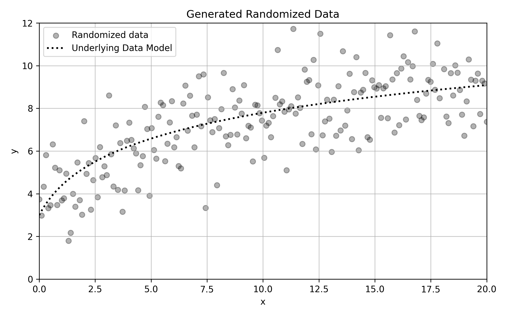
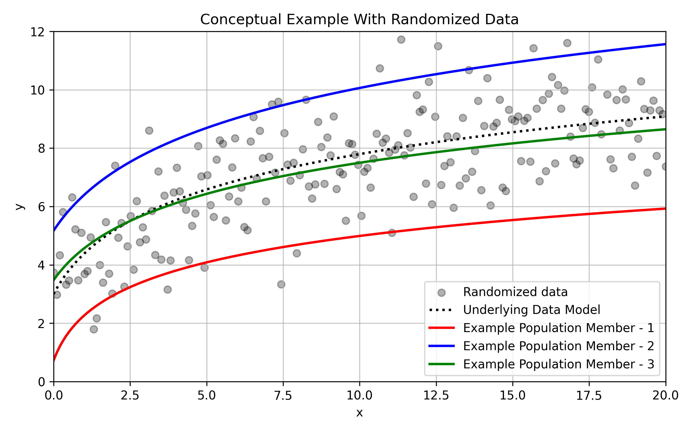

# DE Optimization Explained

## Conceptual Example

*The plot shows the true model `2·ln(x+1)+3` as a curve together with data points randomly generated (directly from the model).*

Given the example data, consider the task of optimizing the fit of a logarithmic function:

$$
y = a \cdot \ln(x + b) + c
$$

For a logarithmic equation in this form, optimize for 3 parameters: 

$$
(a,\;b,\;c)
$$

---

## 1. Begin with an Initial Population of Models

The initial population is a matrix‑like list of randomly (or pseudo‑randomly) generated vectors:

$$
\mathbf{P} = \begin{pmatrix}
\mathit{v_1}\\
\vdots\\
\mathit{v_n}
\end{pmatrix}
$$

the element of each vector being parameters from the model being optimized:

$$
\begin{aligned}
\mathit{v_1} &= (a_1,\;b_1,\;c_1)\\
& \ \ \ \ \ \ \ \ \ \vdots \ \ \ \ \ \vdots \ \ \ \ \ \vdots \ \ \ \ \ \\
\mathit{v_n} &= (a_n,\;b_n,\;c_n)
\end{aligned}
$$

### Visualize a Example Population

Coneptually, the population members can be visualized as multiple curves superimposed on the data.

## 2. Define a Fitness Function

As each member of the population defines a potential model (i.e., curve) to fit over the data, define a fitness function to compare each population member. For example, the root mean square error (RMSE) of each curve can be used:

$$
\text{RMSE}= \sqrt{\frac{\displaystyle\sum (y-p)^2}{n}}
$$

$$
\mathit{Fitness}(\mathit{v}) = \text{RMSE}(\mathit{v})
$$

where

- *y* is the actual value of the data
- *p* is the predicted value from a model
- *n* is the population size

---

## 3. Iterate the Population

The population must evolve across discrete steps, called iterations, with each iteration involving 2 procedures: Mutation and Crossover

### 3.1 Mutation

Mutation involves combining population members to create a new potential mutant population member:

$$
\mathit{v_m}=F(\mathit{v_x},\dots,\mathit{v_z})
$$

where vm is the mutant vector/model, and *v_x* through vz are any number of randomly drawn models from the population. Mutation functions are often simple arithmetic combinations of candidate models. For example, the default mutation function
in this implementation is:
$$
\mathit{v_m}= \mathit{v_x}+M\cdot\bigl(\mathit{v_y}-\mathit{v_z}\bigr)
$$

where $\mathit{v_m}$ is the mutant vector, and $\mathit{v_x}$ through $\mathit{v_z}$ are randomly selected models from the population. Additionally, $\mathit{M}$ is a simple numerical constant set by the user. Constants such as this one are often included in mutation functions as they allow users to influence variation within the mutation process.

### 3.2 Crossover

Crossover involves selecting or creating a function that determines whether a mutant model replaces any single population member, as this function is applied to every individual population member. A commonly used crossover function is a simple binomial function wherein a randomly determined constant number (between 0 and 1) is compared to a crossover constant:

$$
v_n = v_m\ if\ \mathit{\mathbf{X}} > C\ else\ v_n = v_i
$$

where $\mathit{v_n}$ is the model being recorded during the iteration, $\mathit{v_m}$ is the potential mutant model, $\mathit{v_i}$ is the current model being considered, $\mathbfit{X}$ is a randomly generated constant between 0 and 1, and $\mathit{C}$ is a simple numerical constant (set by the user) between 0 and 1. In this case, if a user sets a value for $\mathit{C}$  that is closer to 0, more mutants substitutions will occur. If the user sets a value closer to 1, fewer substitutions will occur.

## 4 Finalize via the Fitness Function

Once the initial population of models has evolved, the final step is to compute the fitness value for each evolved model:

$$
\mathit{v_final} = \mathit{Fitness_Best}(\mathbf{P})
$$

The model with the best fitness value is the optimal solution outputted by the algorithm at that particular iteration. Of note, the algorithm can be iterated any arbitrary number of times. It is best to stop when the algorithm "converges" to a model with a fitness function value that does not improve over further iterations.

### Optimal Solution

*Shows the underlying model (black), the fittest curve (green), and the original data points.*

---