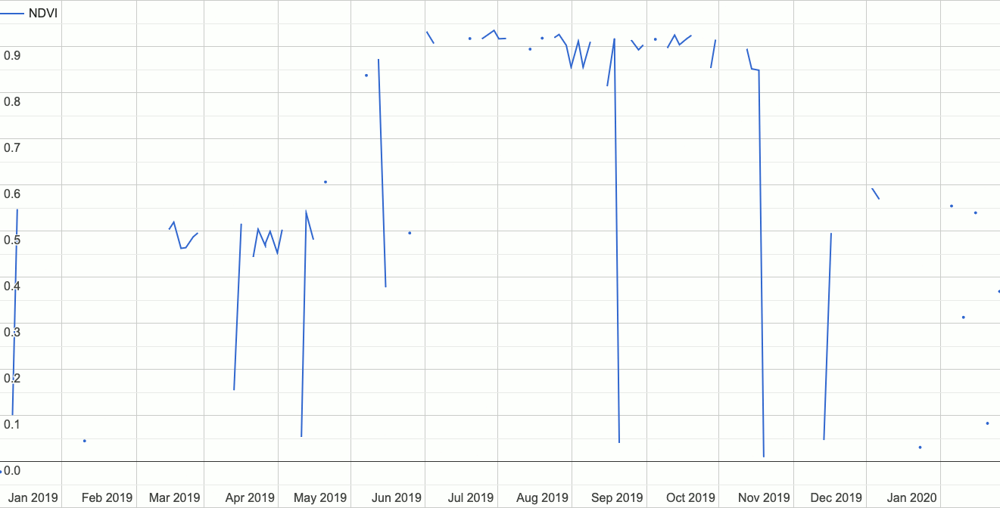

<h1 class="title" style="text-align:center;">🌍🕰️GEEODE📈📉</h1>

<h2 class="subtitle" style="text-align:center;">A <strong>G</strong>oogle <strong>E</strong>arth <strong>E</strong>ngine Implementation of <strong>O</strong>ptimization by <strong>D</strong>ifferential <strong>E</strong>volution</h2>



## Summary

Do you commonly use time series data in Google Earth Engine (henceforth GEE) and are you interested in modelling these time series using mathematical functions of arbitrary forms (e.g., linear, exponential, logarithmic, etc.)? If so, consider GEEODE as an option for your task.

With `geeode` it's possible to optimize any arbitrary close-formed alegbraic model on a time series image collection using a process called differential evolution. Various options exist to fine-tune the analysis, and accompanying statistics measuring the degree of optimization (i.e., "convergence" to a final model) can also be produced.

For full references and additional information, see the [paper](https://github.com/uzh-eoas/geeode/blob/main/paper/paper.pdf).

For questions please contact [Devin Routh](mailto:devin.routh@uzh.ch?subject=GEEODE%20Request) and/or [Claudia Röösli](mailto:claudia.roeoesli@geo.uzh.ch?subject=GEEODE%20Request) with the [University of Zürich Earth Observation Application and Services](https://www.geo.uzh.ch/en/units/rss/research/Earth-Observation-Applications-and-Services.html) group.

## Getting Started / Installation

The analytical functionality offered by `geeode` is available both via the [Google Earth Engine Javascript Code Editor](https://developers.google.com/earth-engine/guides/playground) as well as by using the [GEE Python Module](https://developers.google.com/earth-engine/guides/python_install).

To begin immediately, follow the [quickstart](./quickstart.md).

### Javascript

You can access the analytical functions of `geeode` simply by importing the native GEE module, like so:

```javascript
// Import geeode
var geeode = require('users/uzheoas/geeode:geeode.js');
```

**Note:** the Javascript implementation of `geeode` *only* includes the analytical functions and none of the helper functions (e.g., `pause_and_wait`).

### Python

The Python implementation of `geeode` offers both the analytical functionality as well as the workflow functions.

To use `geeode` from Python, install it from source via:

```python
git clone https://github.com/uzh-eoas/geeode.git
cd geeode
pip install .
```
