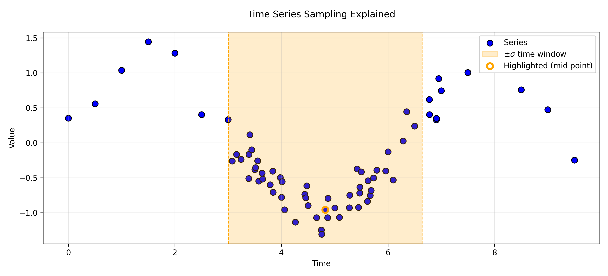

# Subsampling Explained

## Collection Size

The `de_optim` function and algorithm is structured in such a way that larger populations and greater numbers of iterations benefit the optimization process. However, these aspects of the algorithm also face computational limits.

Specifically, if you have **large image collections** (100+) images, it may be efficient (or even necessary) for you to reduce the size of your image collection to overcome computational barriers (e.g., in memory).

## Temporal (Sub)Sampling

Image collections in GEE by their design allow for very specific data structures. Consider the following points:

- Images in collections do not necessarily overlap.
- Images in collections do not necessarily share the same pixel mask.
- Images in collections do not necessarily share the same timestamp.

Due to these attributes, when converting image collections into array-images (e.g., using `toArray()`) to make a single image wherein each pixel contains a single band that itself is a multi-dimensional array composed of the previous individual images, there will often be many empty values due to missing or masked observations in the original images.

Another data-structure implication is that the number of images in the original collection does not necessarily equal the number of actual observations in each pixel cell. If the timestamps for each image are then recorded alongside the observation's value (i.e., as an array image), each pixel grid then has an individual time series recorded at the pixel level (with the added potential for removing missing data values). Pixel grid cells in the array-image (before sampling) will then, often as a result, have varying numbers of observations and the structure could be described as "jagged".

At this point, it is possible to use the array-image time data as a basis for subsampling from the entire time series stack. Doing so:

- reduces the time series size
- can turn "jagged" pixel grid cells into time series of uniform length (without masked observations / NA value "holes")

### Background

The realities of Earth Observation are that datasets are often "jagged" and, moreover, there are often real-world factors that determine the quality of input data.

For example, with satellite imagery, clouds frequently contaminate parts of scenes rendering certain pixel locations unusable. As well, clouds themselves often exhibit seasonal patterns (e.g., "wet" or "rainy" seasons will often have more clouds than "dry" seasons). Therefore, datasets not only exhibit hetereogeneity in missing values across a spatial scale but also across a temporal scale.

The sample time series pictured above illustrates the concepts necessary to understand subsampling. Notice:

- The pictured time series has the most points around the center of the time scale.
- At every point, it's possible to calcuate the number of points neighboring it in time (in other contexts, often called "kernel density").
- When sampling (and therefore reducing the amount of input data) it's optimal first to drop observations with higher temporal density (i.e., denser times) than lower temporal density.

### Sampling Methods

To understand the sampling methods offered, it's important to understand how simple random sampling works conceptually: given any dataset, it's possible to sample data points by assigning a random numeric value between 0 and 1 (exclusive); one can then order the points by these random numbers, and remove `x` number of points sequentially from *the end* of the newly ordered series of datapoints (i.e., the points with the highest or lowest numeric value).

This approach to random sampling has the distinct advantage of allowing arithmetic operations on the numeric values used to sort the data. Namely, one can multiply (i.e., scale) each random numeric value assigned to each data point by a weight value. After doing so, data points with higher weight values will have a greater chance of being sorted *on one end* (the higher end) of the sorted data.

For temporal subsampling within GEEODE, the temporal density for each point around a specified time kernel is used as the scaling weight. The higher a point's temporal density is, the greater the chance it will have a higher numeric value when sorting (and thus the greater the likelihood it will be dropped).

In each figure, the dots represent the observations ordered by temporal density; the observations with the lowest temporal density are prioritized (i.e, "on the top" of each figure). Black dots represent example observations dropped according to the sampling procedure chosen.

#### Simple Weighted Subsampling

Order the observations by temporal density and remove `x` numbers of observations starting with the highest and moving towards the lowest such that the desired number of observations is maintained.

#### "Leapfrog" Sampling

Sort the observations by temporal density (descending, such that the observations with the highest temporal density come last). Beginning with the last observation, remove every other observation until `n` the desired number of observations is achieved.

#### "Split-Shuffle" Sampling

Sorted by temporal density, assign every observation in order to `s` number of groups; order the groups individually by temporal density (descending) then order all groups by natural order (group 1, 2, 3, 4). Starting from the end, remove `x` number of observations until the desired number of observations is maintained.

In other words, the original orientation of the weighted observations looks like so:

After splitting the observations in groups and reordering, the observations would be ordered as such:

## Considerations

There are important data-structure implications to this process. Most notably, the structure of the image collection transforms into an image during this process.

This image can, of course, be converted back into a formal Image Collection object (e.g., by using the `ts_image_to_coll` function). However, the individual images in the resulting Image Collection **will not** maintain any of the original timestamps (and thus must be given a temporal order deliberately). The time data has been shifted from the image-level to the pixel-level.

You can then use the time data in/for other pixel level computations, but the missing timestamp data may also affect any future analyses. Consider the implications of changing your data structure when you plan your analytical workflow.