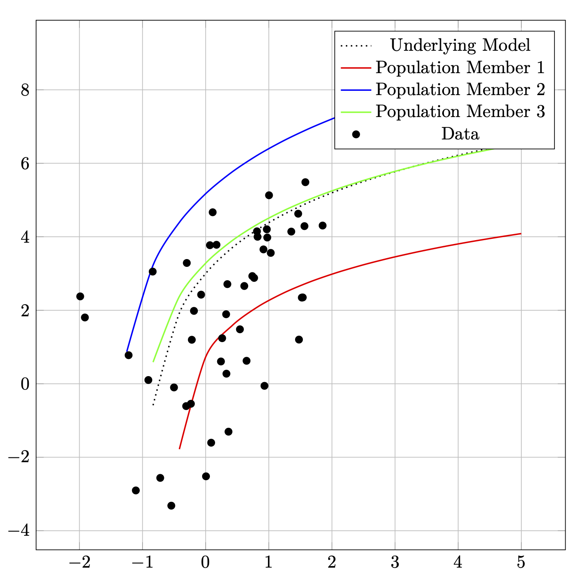

### Abstract

This function module was written for Google Earth Engine (GEE) as an
implementation of the Differential Evolution algorithm for optimizing
functions (i.e., fitting curves) on remotely sensed imagery data. Its
purpose is to allow the user to fit any arbitrary functional form on
GEE's image collection objects, making the module particularly useful
for time series analyses on satellite image collections that require
flexible curve fitting algorithms (e.g., double-logistic functions with
several parameters). The function makes extensive use of the array image
object, which embeds multidimensional arrays at every pixel and thus
allows for matrix calculations using pixel level time series matrices.
Moreover, the module was designed to produce a variety of outputs:
either a final value, i.e., an optimized set of parameters that can be
used to fit a functional form or curve to the image collection data, or
intermediate values called populations. Populations are lists of
candidate parameters that are being considered in the algorithm for
fitting a curve to the image collection data. The option to produce
intermediate outputs in the form of full populations allows users to run
analyses in series to refine the best fit possible, referred to as a
"daisy chain" analysis when done in repetition. Moreover, producing
intermediate outputs also allows users to run multiple populations in
parallel. The function is implemented in both Javascript and Python, and
an example on Sentinel-2 data time series is included.

#### Introduction and Statement of Need

Optimization algorithms based on natural selection, also called genetic
or evolutionary algorithms, have been used since the 1950\'s [@mitchell1998introduction]
and continue to be re-examined for use as well as development
[@ahmad2022differential][@das2016recent][@das2010differential][@pant2020differential][@price2006differential].
The idea is simple: iterate a population of candidate solutions to a problem
while mixing candidate solutions in the same ways that populations of
organisms undergo genetic variation. For example, if you have
observation points in 2 dimensions (see the algorithm figure below), and
you need to fit a specific mathematical model (e.g., such as a
logarithmic function including 3 parameters *a*, *b*, and *c* ), the
algorithm proceeds by (1) randomly generating a population of candidate
mathematical models that are fit to the data (2) then undergoing an
"evolution" process where you mix/combine best fitting models,
iteratively, until a satisfactory model has been reached.

Storn and Price [@storn1997differential] developed such an algorithm that they called
differential evolution (DE) that is particularly suited for optimizing
non-continuous and non-differentiable real-valued functions using
real-valued parameters, and the approach has since been applied in a
number of scholarly fields [@biesbroek2006comparison][@feoktistov2006differential]
[@price2005application][@qing2010basics]. Nowadays, there are multiple software packages
available to run DE, including a [package
in](https://cran.r-project.org/web/packages/DEoptim/index.html) R
[@mullen2011deoptim], a [function in
SciPy](https://docs.scipy.org/doc/scipy/reference/generated/scipy.optimize.differential_evolution.html),
and commercial tools in
[MatLab](https://www.mathworks.com/matlabcentral/fileexchange/18593-differential-evolution)
and
[Mathematica](https://reference.wolfram.com/language/tutorial/ConstrainedOptimizationGlobalNumerical.html).

The implementation of DE in GEE aims to assist with modelling time
series data using arbitrary mathematical models (e.g., linear,
parabolic, logarithmic, etc.) on global-scale remote sensing
datasets—especially when single pixels have sparse observations, such
as when remotely sensed data is heavily impeded by cloud cover, and the
process to fit a model through more standard regression modelling
approaches are unsuitable. Moreover, the algorithm is structured to
allow the production of intermediate outputs (in the form of populations
of optimized models, rather than just a final optimized model), which
allows users to take advantage of GEE's queueing system and gives
greater options for task-based parallelization to accomplish
computationally rigorous workflows on large amounts of imagery.

#### Overview, Key Features, Implementation Philosophy, and Opportunities for Development

An understanding of the differential evolution algorithm is necessary
when using the function module. As such, [the appendix](appendix.pdf) fully illustrates
the concepts and processing steps. Importantly, the components of such a
genetic algorithm include:

- Population: a population of candidate solutions to a problem; i.e., in
  this case a generated set of parameters, each defining a mathematical
  model that can be used to model a dataset. A population can be
  understood mathematically as a matrix of numbers (or a list of
  vectors) where every row is a candidate parameter set with the columns
  being the parameters that are used to define a model.

- Fitness: the objective of this algorithm is to optimize the fitness of
  the population. Fitness is any metric that measures the quality of a
  candidate models and thus allows for the comparison of candidate
  solutions in a population. In this implementation of DE Optim, root
  mean square error (RMSE) is used by default. At any point during the
  process (i.e., after any number of iterations), the fittest candidate
  solution can be selected from the population based on this fitness
  metric. Thus, after a chosen number of iterations, the candidate model
  (i.e., the parameter set) describing the fittest curve is considered
  the optimized model.

- Evolution: the population of candidate solutions is mixed and,
  ultimately, improved via a combination of procedures with the goal of
  gradually optimizing the population's fitness. Evolution occurs
  iteratively, meaning there are discrete steps to mix/combine models
  and attempt to increase the population's fitness. Two such procedures
  are:

  - Mutation: combining multiple candidate models to create a new hybrid
    model--a mutant--which can become a new member of the population. A
    mutant can be considered the genetic offspring of the candidates
    used during the mutation procedure. To perform a mutation step, a
    mutation function must be chosen that selects 1 or more candidate
    population members and mixes them in some way. The most common
    mutation functions involve selecting population candidates at random
    then combining their parameters using simple arithmetic or selecting
    the fittest population member(s) and performing augmentations on it
    or with other population members. The GEE implementation allows
    mutation via randomly selected population members (i.e., from the
    code: *rand*) or mutation using the fittest population member(s)
    (i.e., from the code: *best*).

  - Crossover: this is a procedure whereby new candidate solutions,
    either completely randomly generated or generated via a mutation
    process, are considered to replace the existing candidate solutions
    within a population. The crossover procedure can involve using a
    random process (e.g., the equivalent of rolling a die to determine
    success/failure) or it can be a function of any population or
    candidate characteristics. For example, you could flip a coin: if
    the outcome is heads, a mutant candidate is compared to one of the
    existing population candidates then the fitter of the two is kept in
    the population; if the outcome is tails, the population candidate
    being considered is maintained in the population without any
    alteration.

The algorithm progresses from an initially randomly or pseudorandomly
generated set of candidates to a final fittest population candidate that
is the optimal model describing the best fitting curve for the data. A
pseudorandomly generated population can be used if the user knows the
bounds of the parameters being optimized; these bounds can be inputted
to the DE function to set the limits of a population's individual
variation and limiting the types of curves that will be considered. For
example, to optimize a linear equation the user may know that *m* may
vary only between 1 and 3 while *b* can vary only between 0 and 2, so
all model parameters are randomly generated within these bounds. After
generating an initial population, evolution occurs iteratively until a
defined level of fitness is reached.

When searching for optimal parameter values, the algorithm benefits from
a higher number of iterations in addition to a greater number of
potential population members; i.e., optimization will improve when the
algorithm is (1) testing more potential population candidates and (2)
taking a greater number iteration steps to improve these potential
options many times. Both a higher number of population members, as well
as a greater number of iterations, require greater computational memory
and resources. This implementation was structured accordingly to
parallelize computation as much as possible while also making it
possible to iteratively produce intermediary populations as evolution
progresses to produce an eventual optimal candidate solution.

More specifically, if users hit memory limits with their population
number or their number of iterations, the algorithm allows users to
structure their workflow via a divide-and-conquer approach: the users
may run any number of populations independently of one another then
combine the optimal parameter vectors from every separate population run
into a final population that can be further iterated. Dividing the
populations in this way allows users to run multiple sub-populations in
parallel as Earth Engine tasks, with each using the maximum amount of
memory possible for a single task.

This means the maximum population size possible for this function is the
maximum number of population candidates that can be run via a single
Google Earth Engine task for 1 iteration; i.e., a job where all memory
available is used for population size while still making a single
iteration. In this case, a population of mutated vectors from a previous
iteration is used as the input into a further iteration into a follow-up
Google Earth Engine task. It's for this reason that the implementation
allows the export of full populations, in the form of GEE array-images,
rather than just single model parameter sets. It allows users to follow
the daisy-chain procedure with the output of one iteration becoming the
input into the following iteration.

The algorithm is furthermore programmed to help the user decide when
their time series model has been optimized to a desired degree of
fitness; i.e., when a chosen RMSE value has been achieved. The
implementation includes an option to produce an RMSE image, termed a
*screeImage*, to monitor the progression of the optimization success
with a scree plot similar to what is used in dimensional reduction
techniques [@cattell1966scree]. This image is comprised of multiple bands
wherein each band is the best RMSE value from the population at that
iteration. It allows users to determine when convergence on an optimal
value has been achieved and an acceptable final parameter set has been
produced.

At the time of publication, the current mutation functions and the
crossover functions are coded in an attempted modularized fashion so
additional functions can be developed in the future. The current default
mutation option *rand* randomly selects 3 parameter vectors from the
population, computes the difference between 2 of the vectors, multiplies
the difference by a scale factor (i.e., a real number between 0 and 2)
then adds it to the 3rd randomly chosen vector; the other available
mutation function (*best*) performs the same arithmetic except using the
best parameter vector (according to RMSE) instead of a 3rd randomly
chosen vector. The crossover function is a simple binomial wherein each
iteration is tested according to whether a random number generated in
the range of \[0 to 1) from a uniform distribution is higher than a user
supplied cross over value in the range of (0 to 1). Ongoing and future
developments to the code include a helper function to randomly subsample
dense input time series according to relative temporal density, allowing
for greater control of the size of inputs so that memory limits can be
better bypassed as well as potential crossover function variations.

#### Pseudocode of the Default Algorithm

For reference, the following pseudocode describes the implementation of
the algorithm and the parts that have been opened for parallelization:

- $Step\ 1 - \ Create\ or\ Accept\ a\ population\ of\ candidate\ parameter\ vectors$

  - Each population ($P$) has a certain number of vectors ($n$), such
    that $\{ v_{1},v_{2},\ldots,v_{n}\}$ is comprised of individual
    parameter vectors ($v_{n}$).

  - Each vector ($v_{n}$) has a number of real valued elements equal to
    the number parameters being optimized ($p$ from the function being
    optimized $F(x_{1\ldots}x_{p}$)).

  - Populations can be randomly generated across bounded sets of real
    numbers or \"inherited" either in totality or vector-by-vector from
    previous iterations of evolution.

- $Step\ 2 - \ Evolve\ the\ population$

  - Apply a mutation function ($F_{mutation}(v_{1},v_{2},\ldots,v_{n})$)
    from any number of population vectors that creates a new candidate
    vector ($v_{c}$) that can be compared to an existing population
    vector ($v_{y}$), repeating the procedure for all vectors of the
    population ($\{ v_{1},v_{2},\ldots,v_{n}\}$).

  - Apply a crossover function ($F_{crossover}$($v_{y}{,v}_{c}$))
    wherein the candidate vector is only accepted as a new member of
    population if any arbitrary constraints are met.

  - Accept the candidate vector ($v_{c}$) as a replacement for the
    existing population vector ($v_{y}$) if the function contributes to
    greater optimization of the model/function (e.g., RMSE for the
    fitted time series is reduced).

- $Step\ 3 - \ Produce\ the\ desired\ output$

  - If an acceptable reduction in RMSE is observed in the scree plots,
    then return the final parameter vector ($v_{y}$) from the population
    ($P$) that results in the optimal fit of the time series.

  - If greater optimization can still be attained, which can be assessed
    using a scree plot, output an entire population ($P$) that can be
    used as a starting population, or which can be sliced into
    individual vectors to create mixed populations.

    - This step allows users the possibility to spread a greater number
      of population members across multiple tasks; i.e., parallelization
      at the task level can occur here.

  - For heuristic purposes, it is also possible to produce the metric
    being assess for optimization (e.g., RMSE) after each mutation step.

#### Acknowledgements

We would like to acknowledge that our research was funded partly by the Canton of Zürich and partly through a Google Earth Engine research award.

#### Citations
