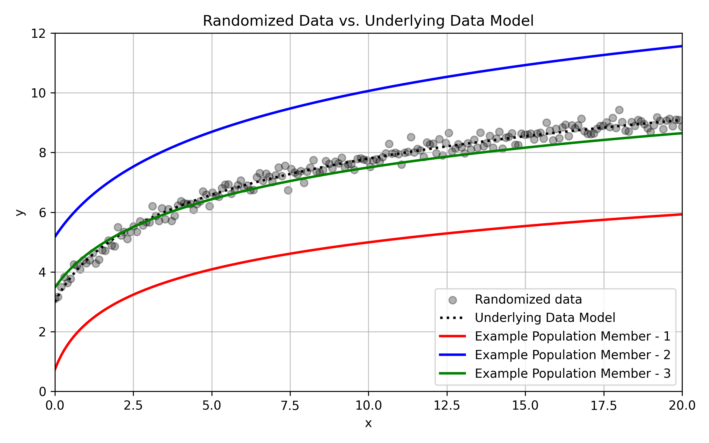

### Abstract

This function module was written for Google Earth Engine (GEE) as an
implementation of the Differential Evolution algorithm for optimizing
functions (i.e., fitting curves) on remotely sensed imagery data. Its
purpose is to allow the user to fit any arbitrary functional form on
GEE's image collection objects, making the module particularly useful
for time series analyses on satellite image collections that require
flexible curve fitting algorithms (e.g., double-logistic functions with
several parameters). The function makes extensive use of the array image
object, which embeds multidimensional arrays at every pixel and thus
allows for matrix calculations using pixel level time series matrices.
Moreover, the module was designed to produce a variety of outputs:
either a final value, i.e., an optimized set of parameters that can be
used to fit a functional form or curve to the image collection data, or
intermediate values called populations. Populations are lists of
candidate parameters that are being considered in the algorithm for
fitting a curve to the image collection data. The option to produce
intermediate outputs in the form of full populations allows users to run
analyses in series to refine the best fit possible, referred to as a
"daisy chain" analysis when done in repetition. Moreover, producing
intermediate outputs also allows users to run multiple populations in
parallel. The function is implemented in both Javascript and Python, and
an example on Sentinel-2 data time series is included.

#### Statement of Need

Optimization algorithms based on natural selection, also called genetic
or evolutionary algorithms, have been used since the 1950\'s [@mitchell1998introduction]
and continue to be re-examined for use as well as development
[@ahmad2022differential][@das2016recent][@das2010differential][@pant2020differential][@price2006differential].
The idea is simple: iterate a population of candidate solutions to a problem
while mixing candidate solutions in the same ways that populations of
organisms undergo genetic variation. For example, if you have
observation points in 2 dimensions (see the algorithm figure below), and
you need to fit a specific mathematical model (e.g., such as a
logarithmic function including 3 parameters *a*, *b*, and *c* ), the
algorithm proceeds by (1) randomly generating a population of candidate
mathematical models that are fit to the data (2) then undergoing an
"evolution" process where you mix/combine best fitting models,
iteratively, until a satisfactory model has been reached.

Storn and Price [@storn1997differential] developed such an algorithm that they called
differential evolution (DE) that is particularly suited for optimizing
non-continuous and non-differentiable real-valued functions using
real-valued parameters, and the approach has since been applied in a
number of scholarly fields [@biesbroek2006comparison][@feoktistov2006differential]
[@price2005application][@qing2010basics]. Nowadays, there are multiple software packages
available to run DE, including a [package
in](https://cran.r-project.org/web/packages/DEoptim/index.html) R
[@mullen2011deoptim], a [function in
SciPy](https://docs.scipy.org/doc/scipy/reference/generated/scipy.optimize.differential_evolution.html),
and commercial tools in
[MatLab](https://www.mathworks.com/matlabcentral/fileexchange/18593-differential-evolution)
and
[Mathematica](https://reference.wolfram.com/language/tutorial/ConstrainedOptimizationGlobalNumerical.html).

The implementation of DE in GEE aims to assist with modelling time
series data using arbitrary mathematical models (e.g., linear,
parabolic, logarithmic, etc.) on global-scale remote sensing
datasets—especially when single pixels have sparse observations, such
as when remotely sensed data is heavily impeded by cloud cover, and the
process to fit a model through more standard regression modelling
approaches are unsuitable. Moreover, the algorithm is structured to
allow the production of intermediate outputs (in the form of populations
of optimized models, rather than just a final optimized model), which
allows users to take advantage of GEE's queueing system and gives
greater options for task-based parallelization to accomplish
computationally rigorous workflows on large amounts of imagery.

#### Implementation and Opportunities for Development

When searching for optimal parameter values, the algorithm benefits from
a higher number of iterations in addition to a greater number of
potential population members; i.e., optimization will improve when the
algorithm is (1) testing more potential population candidates and (2)
taking a greater number iteration steps to improve these potential
options many times. Both a higher number of population members, as well
as a greater number of iterations, require greater computational memory
and resources. This implementation was structured accordingly to
parallelize computation as much as possible while also making it
possible to iteratively produce intermediary populations as evolution
progresses.

More specifically, if users hit memory limits with their population
number or their number of iterations, the algorithm allows users to
structure their workflow via a divide-and-conquer approach: the users
may run any number of populations independently of one another then
combine the optimal parameter vectors from every separate population run
into a final population that can be further iterated. Dividing the
populations in this way allows users to run multiple sub-populations in
parallel as Earth Engine tasks, with each using the maximum amount of
memory possible for a single task.

This means the maximum population size possible for this function is the
maximum number of population candidates that can be run via a single
Google Earth Engine task for 1 iteration; i.e., a job where all memory
available is used for population size while still making a single
iteration. In this case, a population of mutated vectors from a previous
iteration is used as the input into a further iteration into a follow-up
Google Earth Engine task. It's for this reason that the implementation
allows the export of full populations, in the form of GEE array-images,
rather than just single model parameter sets. It allows users to follow
the daisy-chain procedure with the output of one iteration becoming the
input into the following iteration.

The algorithm is furthermore structured to produce metrics that help the user 
decide whentheir time series model has been optimized to a desired degree of
fitness; i.e., when a chosen RMSE value has been achieved. The
implementation includes an option to produce an RMSE image, termed a
*screeImage*, to monitor the progression of the optimization success
with a scree plot similar to what is used in dimensional reduction
techniques [@cattell1966scree]. This image is comprised of multiple bands,
wherein each band is the best RMSE value from the population at that
iteration. It allows users to determine when convergence on an optimal
value has been achieved and an acceptable final parameter set has been
produced.

At the time of publication, the current mutation functions and the
crossover functions are coded in an attempted modularized fashion so
additional functions can be developed in the future. The current default
mutation option *rand* randomly selects 3 parameter vectors from the
population, computes the difference between 2 of the vectors, multiplies
the difference by a scale factor (i.e., a real number between 0 and 2)
then adds it to the 3rd randomly chosen vector; the other available
mutation function (*best*) performs the same arithmetic except using the
best parameter vector (according to RMSE) instead of a 3rd randomly
chosen vector. The crossover function is a simple binomial wherein each
iteration is tested according to whether a random number generated in
the range of \[0 to 1) from a uniform distribution is higher than a user
supplied cross over value in the range of (0 to 1). Ongoing and future
developments to the code include a helper function to randomly subsample
dense input time series according to relative temporal density, allowing
for greater control of the size of inputs so that memory limits can be
better bypassed as well as potential crossover function variations.

### Additional Functionality

In addition to the core functionality provided by the `de_optim` function, 
specific functions have been provided (both analytical and practical) to
allow users the ability to customize their workflows.

#### Temporal Subsampling

Given the constraints on memory that effect the parameterization of the 
optimization process, a temporal subsampling function has been added to give 
users the ability to reduce the size of the image collections being used 
as the basis for their optimization tasks.

The subsampling function specifically allows for a temporal subsetting process, 
in which every pixel's time-series of observations is sampled according to their
temporal density; i.e., time series are reduced to a specific size by removing 
the necessary number points at an individual pixel-level according to their 
relative frequency across the timespan through a weighted-random sampling 
process wherein the weights are the calculated as the density of observations 
around a specified time-window/kernel. See the [documentation](https://uzh-eoas.github.io/geeode/subsampling/)
for more details.

### Testing

Included in the repo is also a PyTest based testing framework to confirm the 
correct operation of the algorithm. It works by asserting specific algorithmic 
conditions when tested across arbitrary functional forms specified with 
randomly generated parameter sets. In other words, the testing process allows 
users to confirm that that algorithm:

- **Generates sets of functional coefficients** on **arbitrary **closed-form 
    algebraic functions** such that each coefficient **falls within the numeric bounds** provided.
- Moreover, when the coefficient sets are being assessed **as the iterations** 
    **proceed**, the fitness score of the coefficients **either improves or** 
    **stabilizes without exception**.

The existing PyTest framework assesses a variety of functional families— 
currently including multiple replicates of logarithmic, exponential, harmonic, 
and linear functions—while also allowing users a structure to expand on the 
tests _ad hoc_ in order to affirm algorithmic fidelity.

#### Acknowledgements

We would like to acknowledge that our research was funded partly by the Canton 
of Zürich and partly through a Google Earth Engine research award.

#### Citations
